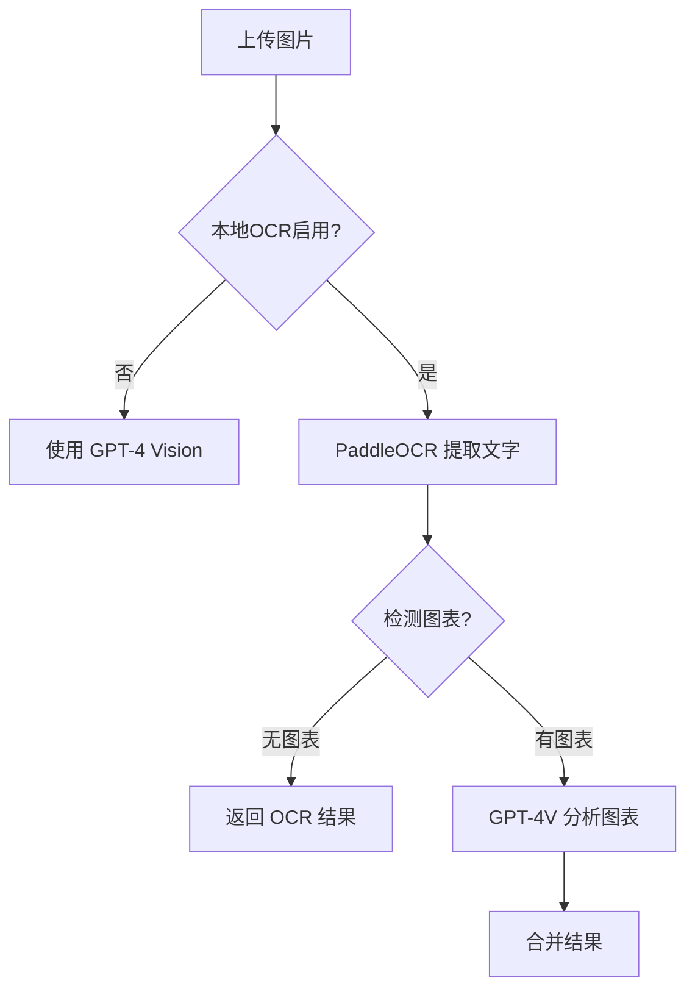

# PaddleOCR 本地 OCR 安装指南

本指南将帮助您在 POA Master 中启用高精度的本地 OCR 功能，提升图片识别速度并降低 API 成本。

## 功能特性

### 🚀 智能路由策略
系统会自动选择最佳识别方案：

| 内容类型 | 识别方案 | 优势 |
|---------|---------|------|
| **纯文字截图** | PaddleOCR | 速度快、免费、中文识别精度高 |
| **图表/流程图** | GPT-4 Vision | 深度理解图表语义和趋势 |
| **复杂文档** | 混合方案 | 先用 PaddleOCR 提取文字，再用 GPT-4V 分析图表 |

### 💰 成本对比

**纯 GPT-4 Vision（当前）**：
- 每张图片：~$0.01-0.03 USD
- 100 张图片：~$1-3 USD

**智能路由（本地 OCR）**：
- 纯文字图片：$0（完全免费）
- 包含图表：~$0.01 USD（仅图表分析）
- 100 张图片：~$0.2-0.5 USD（**节省 80%+ 成本**）

## 安装步骤

### 1. 安装 Python 环境

确保您的系统已安装 Python 3.8+：

```bash
# macOS/Linux
python3 --version

# Windows
python --version
```

如果未安装，请访问 [python.org](https://www.python.org/downloads/) 下载。

### 2. 安装 PaddleOCR

```bash
# 安装 PaddlePaddle（CPU 版本）
pip3 install paddlepaddle -i https://mirror.baidu.com/pypi/simple

# 安装 PaddleOCR
pip3 install paddleocr
```

**GPU 加速（可选）**：如果您有 NVIDIA GPU，可以安装 GPU 版本以获得更快速度：

```bash
# 安装 PaddlePaddle GPU 版本（需要 CUDA）
pip3 install paddlepaddle-gpu -i https://mirror.baidu.com/pypi/simple

# 安装 PaddleOCR
pip3 install paddleocr
```

### 3. 测试安装

```bash
# 测试 PaddleOCR 是否正常工作
python3 scripts/ocr.py <测试图片路径>
```

**注意**：首次运行会自动下载模型文件（~10MB），请耐心等待。

### 4. 配置环境变量

编辑 `.env` 文件，添加以下配置：

```bash
# 启用本地 OCR
USE_LOCAL_OCR=true

# Python 路径（可选，默认使用 python3）
PYTHON_PATH=python3

# macOS 示例
# PYTHON_PATH=/usr/bin/python3

# Windows 示例
# PYTHON_PATH=C:\Python39\python.exe
```

### 5. 重启应用

```bash
npm run dev
```

## 验证安装

### 方式1：上传图片测试

1. 访问 `/roundtable/new` 或 `/assignees/[id]`
2. 上传一张包含文字的图片
3. 查看终端日志，应该看到：

```
[SmartOCR] Extracting text with PaddleOCR...
[SmartOCR] PaddleOCR extracted 150 characters
[SmartOCR] Chart detection: no
[FileProcessor] Image OCR completed using paddleocr
```

### 方式2：直接测试脚本

```bash
# 测试纯文字识别
python3 scripts/ocr.py test-image.png

# 应该输出识别的文字
```

## 工作原理

### 智能检测流程



### 图表检测逻辑

系统通过以下方式判断图片是否包含图表：

1. **文件大小**：< 50KB 的图片通常是纯文字截图
2. **文字密度**：文字数 / 文件大小 < 50 字/KB 时可能包含图表
3. **示例**：
   - 微信聊天截图：通常 > 100 字/KB → 纯文字
   - 销售图表截图：通常 < 30 字/KB → 包含图表

## 性能优化

### PaddleOCR 配置选项

编辑 `scripts/ocr.py` 可以调整识别参数：

```python
ocr = PaddleOCR(
    use_angle_cls=True,      # 支持旋转文字
    lang='ch',               # 中文+英文
    use_gpu=True,            # 启用 GPU（如有）
    det_db_thresh=0.3,       # 降低可检测更多文本
    det_db_box_thresh=0.5,   # 文本框阈值
    use_space_char=True,     # 识别空格
)
```

### GPU 加速

如果您有 NVIDIA GPU 且已安装 CUDA：

1. 安装 GPU 版本：`pip3 install paddlepaddle-gpu`
2. 在 `scripts/ocr.py` 中设置 `use_gpu=True`
3. 速度可提升 3-5 倍

## 故障排除

### 问题1：找不到 Python 命令

**错误**：`Failed to spawn OCR process: python3 not found`

**解决**：在 `.env` 中指定完整路径：
```bash
# macOS/Linux
PYTHON_PATH=/usr/local/bin/python3

# Windows
PYTHON_PATH=C:\Python39\python.exe
```

### 问题2：PaddleOCR 导入失败

**错误**：`ModuleNotFoundError: No module named 'paddleocr'`

**解决**：
```bash
# 确认 pip 安装到正确的 Python 版本
python3 -m pip install paddleocr

# 或使用具体路径
/usr/bin/python3 -m pip install paddleocr
```

### 问题3：模型下载失败

**错误**：`Download model failed`

**解决**：
1. 检查网络连接
2. 使用国内镜像加速：
   ```bash
   pip3 install paddleocr -i https://mirror.baidu.com/pypi/simple
   ```
3. 手动下载模型后放到 `~/.paddleocr/` 目录

### 问题4：识别速度慢

**解决**：
1. 启用 GPU 加速（如有）
2. 降低图片分辨率（压缩大图）
3. 调整 `det_db_thresh` 参数

### 问题5：中文识别不准

**解决**：
1. 确认使用 `lang='ch'` 参数
2. 提高图片质量（避免模糊截图）
3. 调整 `det_db_thresh` 降低到 0.2

## 高级配置

### 禁用本地 OCR

如果遇到问题，可以临时禁用本地 OCR：

```bash
# .env
USE_LOCAL_OCR=false
```

系统会自动回退到 GPT-4 Vision。

### 强制使用本地 OCR

如果想完全使用本地 OCR（包括图表）：

编辑 `lib/ocr/smart-ocr.ts`，修改 `detectCharts()` 方法：

```typescript
private async detectCharts(buffer: Buffer, ocrText: string): Promise<boolean> {
  // 始终返回 false，不使用 GPT-4 Vision
  return false;
}
```

## 支持的图片格式

- ✅ PNG
- ✅ JPG/JPEG
- ✅ WEBP
- ✅ PDF（通过 unpdf 转图片后识别）

## 性能基准

测试环境：MacBook Pro M1，16GB RAM

| 场景 | PaddleOCR | GPT-4 Vision |
|-----|-----------|--------------|
| **微信聊天截图** | 0.5s | 3-5s |
| **纯文字文档** | 0.8s | 4-6s |
| **包含图表** | 1.2s + 3s | 4-6s |
| **成本（100张）** | $0.2 | $2 |

## 常见问题

**Q：是否必须安装 PaddleOCR？**
A：不是。如果未安装，系统会自动使用 GPT-4 Vision。

**Q：安装后需要重启应用吗？**
A：是的，需要重启 `npm run dev` 以加载新的环境变量。

**Q：如何查看使用的是哪种方法？**
A：查看终端日志，会显示 `method: 'paddleocr'` 或 `'gpt4-vision'`。

**Q：PaddleOCR 支持哪些语言？**
A：支持中文、英文及 80+ 种语言，详见 [PaddleOCR 文档](https://github.com/PaddlePaddle/PaddleOCR)。

## 相关链接

- [PaddleOCR GitHub](https://github.com/PaddlePaddle/PaddleOCR)
- [PaddlePaddle 官网](https://www.paddlepaddle.org.cn/)
- [Python 下载](https://www.python.org/downloads/)

## 更新日志

- **2025-01-XX**：初始版本，支持智能路由和混合识别

---

如有问题，请在 GitHub Issues 中反馈。
